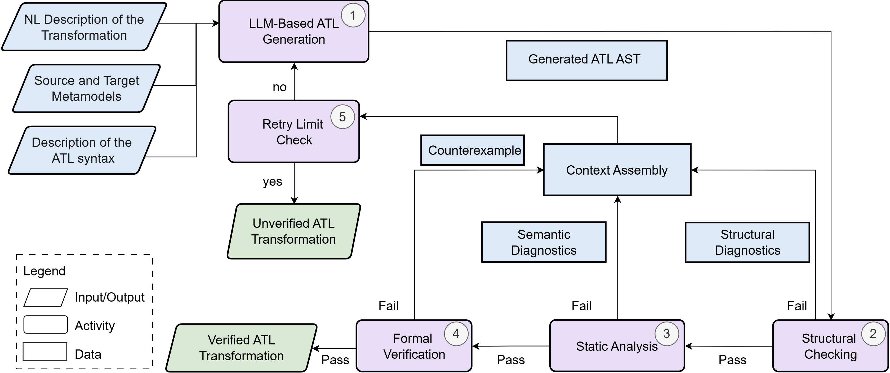

# Neuro-Symbolic LLM-Based Generation and Verification of ATL Transformations

This project presents a neuro-symbolic pipeline for generating ATL model transformations from metamodels and natural-language requirements, then progressively improving their correctness through structural checking, static analysis, and formal verification with violation-driven feedback.

The `main` branch contains the primary project code.

## Pipeline Overview



## Getting Started

### 1. Install the Python dependencies

From the repository root, open PowerShell and run:

```powershell
cd .\LLM4ATL_Project\Neuro_Symbolic_Pipeline
python -m pip install --upgrade pip
python -m pip install -r requirements.txt
```

### 2. Configure the API key

Create a local `.env` file from the provided template:

```powershell
Copy-Item .env.example .env
```

Open `.env`, select one provider, and add the corresponding API key. For example, to use Gemini:

```dotenv
LLM_PROVIDER=gemini
LLM_MODEL=gemini-3.5-flash
GEMINI_API_KEY=your_gemini_api_key_here
```

The other supported configurations are:

```dotenv
# OpenAI
LLM_PROVIDER=openai
LLM_MODEL=gpt-5.1
OPENAI_API_KEY=your_openai_api_key_here

# Anthropic Claude
LLM_PROVIDER=claude
LLM_MODEL=claude-sonnet-4-5
ANTHROPIC_API_KEY=your_anthropic_api_key_here
```

Only the key for the selected provider is required. Keep `.env` private and never commit a real API key to the repository.

The validation layers are enabled by default. The switches and bounded-search settings in `.env.example` can be changed when running an ablation study or adjusting formal verification.

### 3. Run the main pipeline

While still inside `LLM4ATL_Project/Neuro_Symbolic_Pipeline`, run:

```powershell
python main.py
```

The pipeline processes the configured benchmark cases in sequence. For each case, it:

1. reads the natural-language requirement and its source and target Ecore metamodels;
2. asks the selected LLM to generate an ATL abstract syntax tree (AST);
3. applies structural checking and static analysis;
4. converts the validated AST into an ATL transformation;
5. runs formal verification and uses detected violations as feedback for another generation attempt.

Progress and validation errors are printed in the terminal. A candidate that passes all enabled layers is saved as the final result.

If an AST JSON file for a case already exists in the output directory, `main.py` skips that case. Rename or remove that specific JSON file before rerunning the pipeline when a fresh generation is required.

### 4. View the generated results

The current repository uses the legacy directory name `ouput`. Generated files can be found at:

```text
LLM4ATL_Project/Neuro_Symbolic_Pipeline/ouput/
├── final_responses/
│   ├── atl_ast/              # Generated ATL AST files in JSON format
│   └── atl/                  # Generated ATL transformations
└── formal_verification/      # Layer 3 candidates, reports, and verification artifacts
```

For example, the Families-to-Persons results are:

```text
ouput/final_responses/atl_ast/FamiliesToPersons_All.json
ouput/final_responses/atl/FamiliesToPersons_All.atl
```

The code also supports the corrected directory name `output`; it will use `ouput` while that legacy directory exists.

## Validate the Generated ATL Transformations

Run the parser before the functional tests. The test runner uses the CSV report produced by the parser to decide which transformations can be executed.

### 1. Run ATL Parser

From `LLM4ATL_Project/Neuro_Symbolic_Pipeline`, run:

```powershell
cd ..\ATL_Parser
python -m pip install fastchrf
python testATLParsedRate.py
```

The parser checks the generated ATL files and writes these reports to `LLM4ATL_Project/ATL_Parser/`:

```text
atl_parser_chrf_results_gemini-3-5-flash_neuro_symbolic.csv
atl_parsed_rate_gemini-3-5-flash_neuro_symbolic.csv
atl_chrf_similarity_gemini-3-5-flash_neuro_symbolic.csv
```

Report fields:

- `Parsed`: whether the transformation passes ATL syntax checking.
- `ProblemCount`: number of syntax problems found by the parser.
- `CHRF_Score`: textual similarity to the reference ATL; it does not measure functional correctness.

### 2. Run ATL Tests

After the parser finishes, continue with:

```powershell
cd ..\ATL_Tests
python run_all_tests.py
```

The runner executes the mapped JUnit test for each syntactically valid transformation and records its functional-test result.

The results are written to:

```text
LLM4ATL_Project/ATL_Tests/atl_test_results_gemini-3-5-flash_neuro_symbolic.csv
LLM4ATL_Project/ATL_Tests/atl_pass_rate_summary_gemini-3-5-flash_neuro_symbolic.csv
```

In `atl_test_results_*.csv`, `test_pass=True` means that the transformation was parsed successfully and passed its associated functional test.
